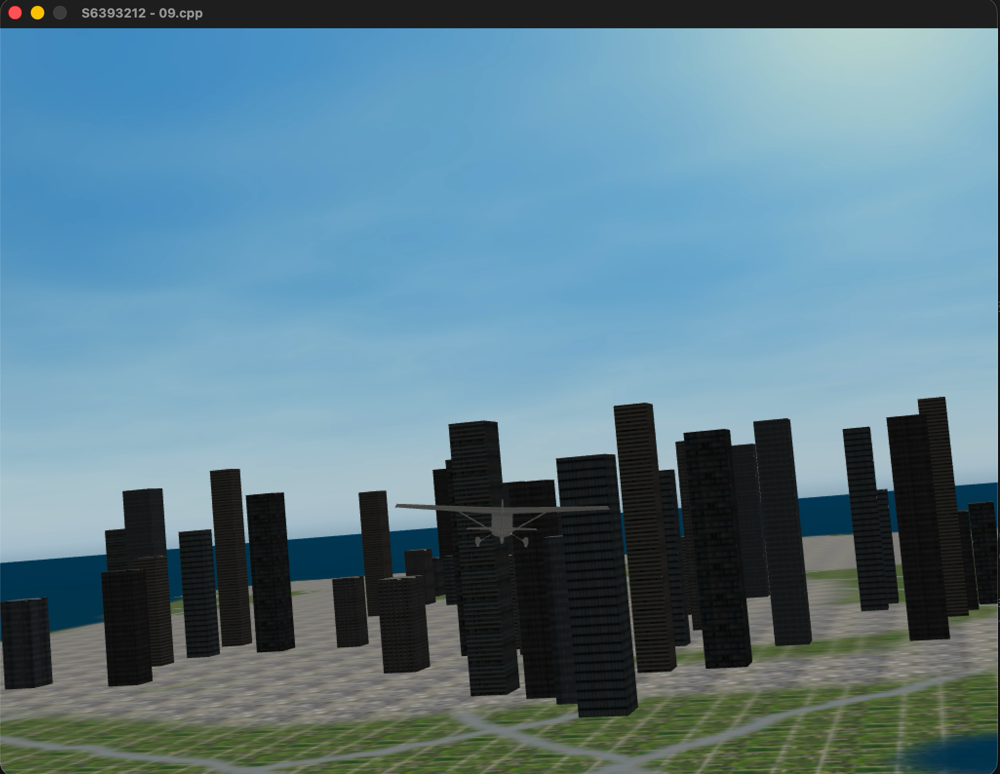

# Fondamenti di Computer Grafica A.A.2025-2026



> **Progetto universitario per il corso di Fondamenti di Computer Grafica (FCG)**  
> **Università degli Studi di Genova (UniGe) - Laurea Triennale in Informatica**

Un simulatore di volo semplificato, sviluppato in C++ utilizzando SFML e OpenGL.

## ✨ Funzionalità Principali

- **Rendering 3D:** Lorem Ipsum
- **Sistema di Telecamere:** Lorem Ipsum
- **Illuminazione:** Implementazione di shading (Modello di Phong) per superfici e modelli.
- **Caricamento Asset:** Gestione dinamica di modelli 3D e mesh dall'ambiente circostante.

## 🛠️ Implementazione

Il progetto è stato interamente sviluppato in **C++**. Il progetto fa affidamento sulle seguenti librerie:

- **SFML (Simple and Fast Multimedia Library):** Gestione del contesto finestra (Window), ricezione degli eventi del sistema operativo e raw input da mouse e tastiera.
- **OpenGL & GLAD:** Rendering con pipeline programmabile. GLAD viene utilizzato per il caricamento a runtime dei puntatori alle funzioni OpenGL.
- **GLM (OpenGL Mathematics):** Libreria header-only per le operazioni di algebra lineare (matrici, vettori, quaternioni) necessarie per le proiezioni e il calcolo spaziale.
- **CMake:** Sistema utilizzato per gestione della build, dipendenze (tramite `FetchContent`) e la cross-compilazione.

## 📂 Struttura del Progetto

```text
PROJECT/
├── 0x/                         # File sorgenti del simulatore
│   └── 0x_game.cpp             # Entry point principale e game loop
├── build/                      # Cartella di output di CMake
│   ├── game                    # Eseguibile binario compilato
│   └── data/                   # Directory di default contenente i modelli 3D
├── resources/                  # Asset e dipendenze locali
│   ├── frag/                   # Fragment shaders (es. shader_phong.frag)
│   ├── vert/                   # Vertex shaders (es. shader_phong.vert)
│   ├── glad/                   # File sorgenti per il loader OpenGL
│   └── include/                # Header files
├── CMakeLists.txt              # Script per la configurazione del sistema di build
└── util/PDF                    # Relazione e Screenshot
```

## 🕹️ Come Compilare e Giocare

Per configurare, compilare ed eseguire il progetto si esegua dalla root del progetto:

```bash
cmake --build build --target game && ./build/game
```

e' possibile inoltre analizzare ogni singola tappa con il relativo step prefisso:

```bash
cmake --build build --target game && ./build/0x_game
```

> **Nota**: L'eseguibile di default si aspetta che la cartella resources si trovi nella directory da cui viene lanciato il comando, per poter caricare correttamente gli shader.

## 👤 Autore

**filippob04**

- Studente di Informatica - Università degli Studi di Genova (UniGe)
- Corso: Fondamenti di Computer Grafica (FCG) A.A. 25-26
- GitHub: [@filippob04](https://github.com/filippob04)

---

_Progetto sviluppato a scopo didattico._
