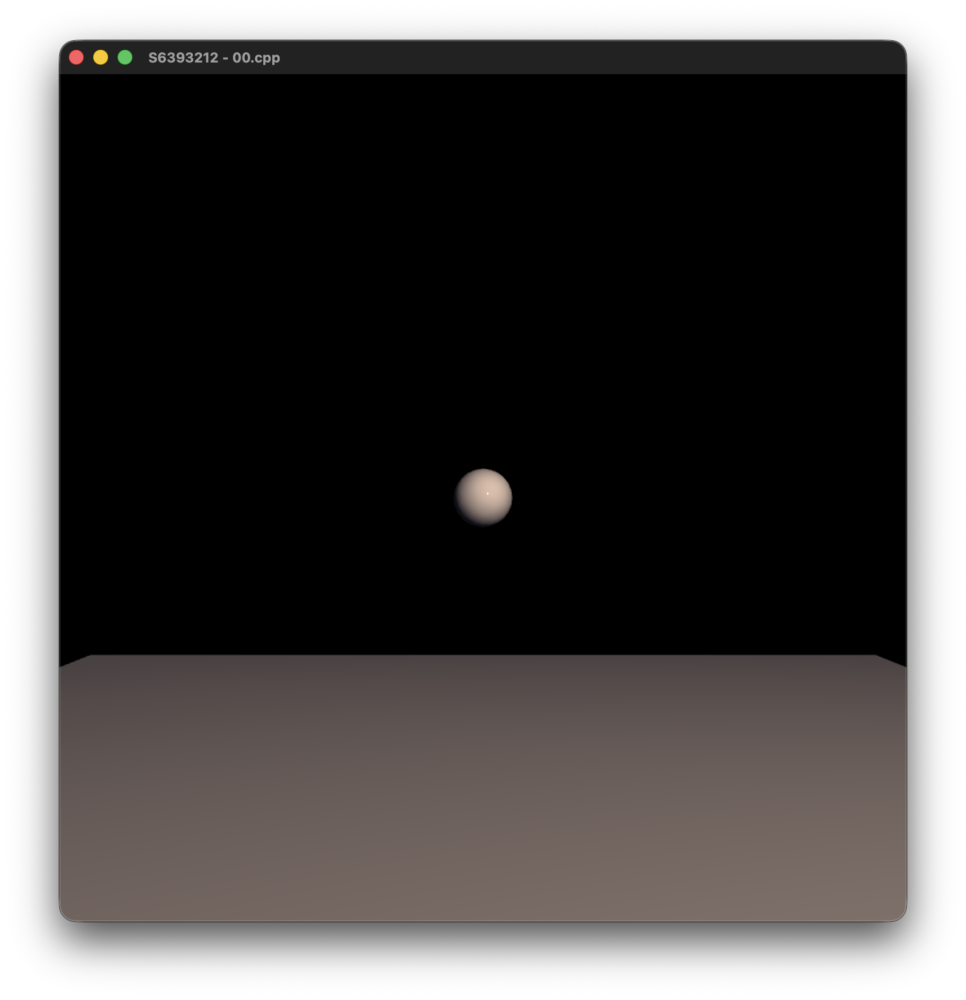
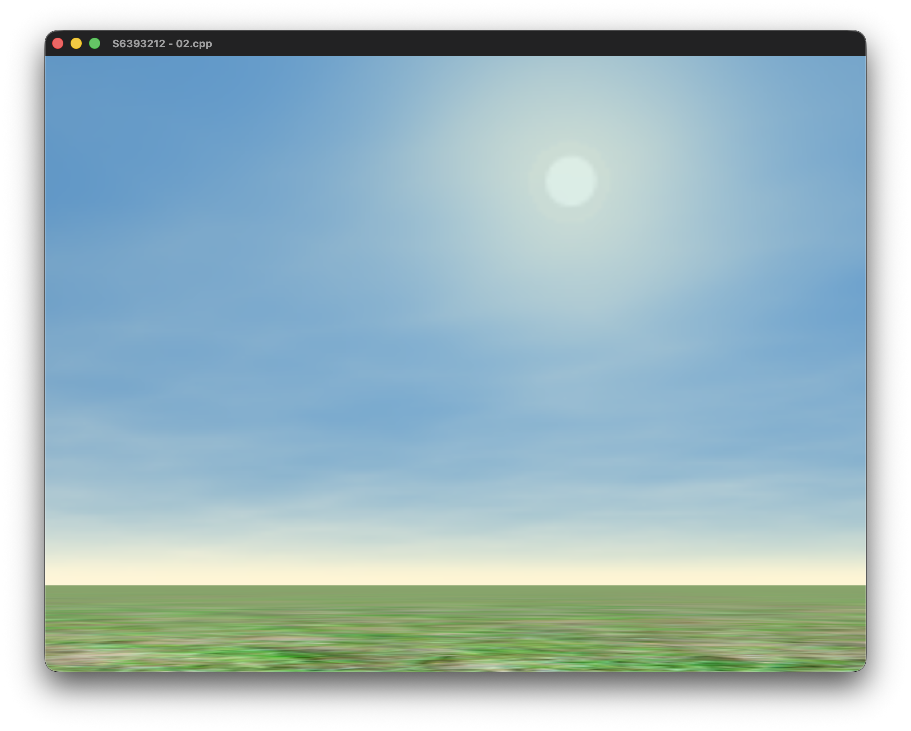
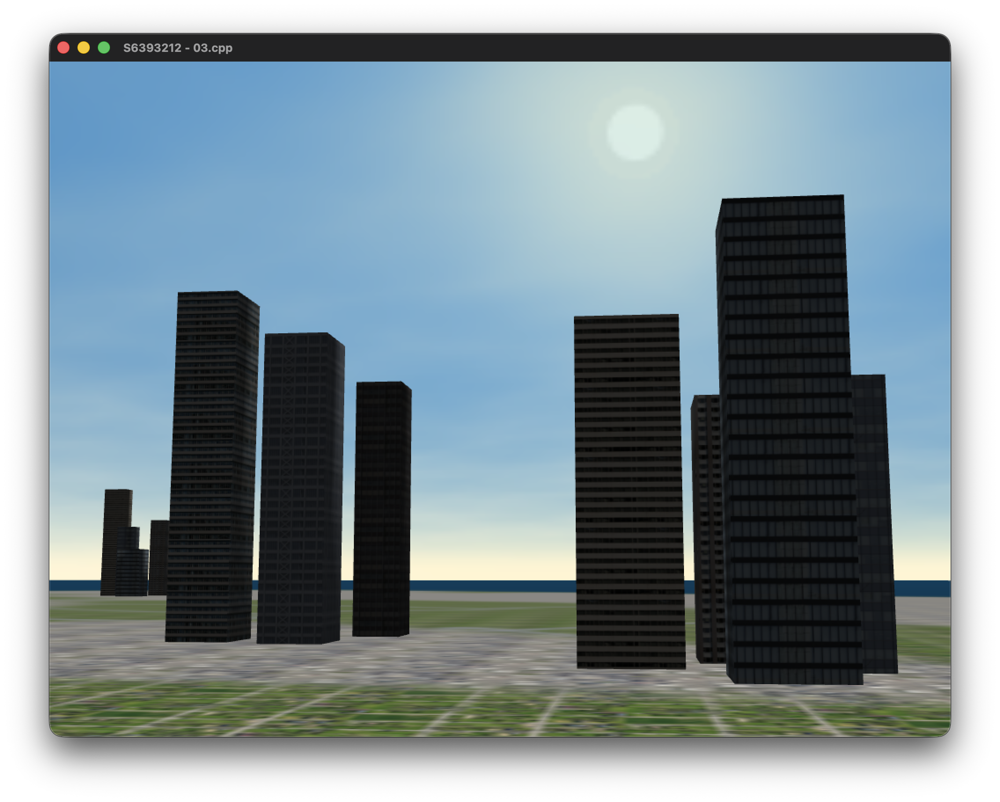

# Relazione Progetto - Baldini Filippo S6393212

Relazione del progetto di Fondamnti di Computer Grafica. \
Versionamento a tappe dello sviluppo di un semplice simulatore di volo.

## Tappa 00: Refactoring e Setup dell'ambiente

Il punto di partenza per lo sviluppo del simulatore è stato il codice sorgente fornito durante l'ultimo laboratorio del corso. L'obiettivo primario di questa fase iniziale è stato il refactoring del codice per transizionare a un ambiente sandbox minimale, base per le future implementazioni.
Le operazioni principali sono state:

- Semplificazione assoluta della scena, ora contiene solo un soggetto e un pavimento.
- Rimozione arbitraria dei paradigmi di shading, mantenendo solo Phong
- Modifica dei path, cartelle e sistema di build.



## Tappa 01: Nuovi controlli per il movimento della telecamera

In questa tappa ho cambiato il paradigma con cui si controlla la telecamera, dal movimento del mouse si e' passato ad un controllo a sei gradi di liberta' da tastiera:

- WASD per Pitch e Yaw (pan_tilt)
- EQ per il Roll
- LShift e LControl per avanzare o indietreggiare

I movimenti, che per ora si basano ancora sugli angoli di eulero, risultano indipendenti fra loro e dall'ambiente circostante.
E' facile notare alcune limitazioni di questa scelta, ad esempio il Gimbal Lock previene la possibilita' di eseguire una rotazione pitch di 360'.

## Tappa 02: Skybox, Luci e Texture base

In questo step fondamentale per lo sviluppo di un qualsiasi videogioco, viene definito un **ambiente**, con un fondale, `skybox` e un pavimento ricoperto da una sola texture spalmata. La prima ha richiesto la creazione di specifici vertex e fragment shader, mentre per il pavimento sono stati adattati quelli precedenti, differenziando materiale da texture. Infine l'unica luce non e' piu' vincolata al movimento della camera ma e' ancorata ad una posizione fissa del sole virtuale.

La `skybox` e' stata implementata utilizzando il campo nativo di OpenGL `GL_TEXTURE_CUBE_MAP`, iterando il caricamento su sei immagini `.png` scaricate dal web che costituiscono le sei facce del cubo. Per renderizzarla e' stato creato uno shader dedicato poiche' per lo sfondo non e' necessario avere un modello di illuminazione complesso (phong). Per forzare ciascuna faccia del cubo come sfondo infinitamente lontano, viene impostata la coordinata di profondita' z a 1.0 (valor massimo).
Infine il vertex shader della skybox calcola e comunica al fragment shader un vettore direzionale (X,Y,Z) necessario per campionare il colore di ciascun frammento del cubo.

Il pavimento ora e' ricoperto da una singola texture continua, per far cio' e' stato necessario modificare lo shader principale sostituendo il calcolo di un colore uniforme con quello proprio di ciascun pixel della texture, sfruttando la ripetizione automatica, `tiling` delle coordinate texture.



## Tappa 03: Texture avanzate, decorazioni ambiente.

Per finalizzare l'ambiente di gioco, in questa tappa sono state aggiunte le seguenti modifiche:

- Texture del suolo sostituita tramite una blend map da quattro texture distinte (Contesto urbano, residenziale, asfalto e acqua).
- Inserimento di un numero arbitrario di rettangoli texturizzati, per rappresentare dei palazzi.
- Un'ulteriore modifica alla luce, ora ha un tono piu' caldo e rispecchia forse meglio quella solare.

Per decorare maggiormente il suolo ho scelto di utilizzare una blend map, ossia un'immagine 2D descritta da soli colori RGB puri (e il nero) grazie alla quale il fragment shader e' in grado di posizionare tramite la funzione `mix(A, B, C.ch)`, le texture fornitegli in input.
Ho scelto questa strada principalmente perche' mi affascinava come concetto, l'alternativa che avevo valutato era quella di considerare il suolo come un enorme griglia e posizionare in ogni cella una specifica texture. Quindi `main_shader.frag` ora e' in grado di applicare ripetutamente una certa texture in base al colore della blend map ottenuta da `GIMP`, cosi' creando un piacevole effetto di sovrapposizione seamless delle texture.

La classe che ha subito la maggior parte delle modifiche e' stata `Scene`, infatti sono stati definiti dei nuovi campi per rappresentare la blend map e un vettore per le diverse texture poi posizionate sul suolo. Nel nuovo metodo `init_ground` non faccio altro che fornire le texture, mentre nella `draw_floor`, ora modificata, eseguo la Bind in GPU. Come nella tappa precedente le texture sono considerate come oggetti della classe `Texture2D`.

In secondo luogo ho deciso di aggiungere all'ambiente ora texturizzato dei semplici elementi, cosi' da poter dare un'idea di scala al mio mondo virtuale.
Similmente al caso precedente, definisco i campi per lo shader, in questo caso creo due vettori, uno per degli oggetti di tipo `building`, associazione fra modello e texture e un secondo per le texture dei palazzi. In questo momento ho valutato due scenari possibili, un posizionamento manuale dei palazzi, oppure sfruttare ulteriormente la blend map per far si che se il suolo e' di un certo tipo allora aggiungo un certo palazzo piuttosto che un altro. La mia scelta e' ricaduta sulla prima possibilita' in quanto era quella che si allineava maggiormente alla mia idea, e risultava anche meno complessa da programmare, seppur l'analisi della blend map sarebbe potuta tornar utile anche in futuro, ad esempio per comportamenti specifici per zona (ad esempio rumori del mare, urbani, etc.).

Quindi ho inserito un totale di 23 palazzi, con posizione e dimensioni definite nel metodo prolisso `init_buildings`. Con una serie di tentativi, valutando arbitrariamente la scena, ottengo cosi' un risultato apprezzabile. Inizialmente avevo deciso di mantenere temporaneamente lo stesso shader condiviso per il suolo e i palazzi; questo e' ottenuto con un valore booleano inviato allo shader che valuta cosa sta manipolando. Non era una soluzione ottimale, infatti nel metodo `draw` avevo dovuto inserire

```cpp
if (blendmap != nullptr) blendmap->Bind(0);
for (int j = 0; j < ground.size(); ++j) {
    ground[j]->Bind(j + 1);
}
```

questo perche' per come ho impostato le texture:

    0 -> skybox (cubemap), blendmap (sampler2D)
    1 -> ground1
    2 -> ground2
    [...]
    4 -> ground4
    5 -> building1
    [...]

succedeva che chiamando prima il metodo `draw_buildings` eseguivo correttamente la bind delle texture dall'indice successivo a ground.size(). Ma ottenevo il warning:
`UNSUPPORTED (log once): POSSIBLE ISSUE: unit 2 GLD_TEXTURE_INDEX_2D is unloadable and bound to sampler type (Float) - using zero texture because texture unloadable` indica che lo shader si aspetta gia' le texture associate al suolo (fornitegli con la draw_floor successiva) e per questo eseguivo una bind preventiva.

Non soddisfatto dalla soluzione trovata ho separato lo shader in due, uno sempre con paradigma phong per il suolo, e uno flat per i palazzi (che alla fine non sono altro che parallelepipedi). La soluzione e' stata trovata eseguendo un refactoring del codice, in particolare ora le classi `Camera` e `Lights` sono separate dallo shader, cosi' facendo posso indipendentemente chiamarle sul suolo e sui palazzi. `draw_cube` ha ricevuto anch'esso una semplice modifica, ora calcola lui le location in GPU delle matrici.

Infine ho modificato, in una serie di tentativi, i valori della luce fino a che non ho trovato una soluzione di mio garbo.


